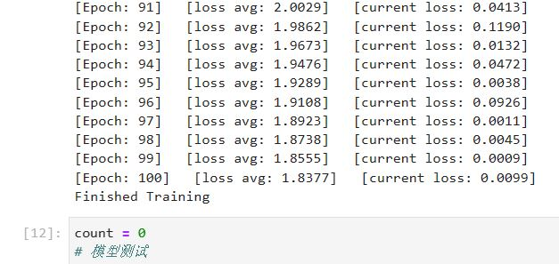

# <center>暑期DL学习week3-xliang</center>

## 1. 论文阅读与视频学习

### 1.1 MobileNet V1 & V2

#### 1.1.1 MobileNet V1


mobilenet的主要改变在于将VGG中的标准卷积层换成了深度可分离卷积层。深度可分离卷积其实是一种可分解卷积操作，其可以分解为两个更小的操作：depthwise convolution和pointwise convolution。Depthwise convolution和标准卷积不同，对于标准卷积其卷积核是作用在所有的输入通道上，而depthwise convolution针对每个输入通道采用不同的卷积核，就是说一个卷积核对应一个通道，所以说depthwise convolution是depth级别的操作。而pointwise convolution其实就是普通的卷积，只不过其采用1x1的卷积核。

#### 1.1.2 MobileNet V2


相比于MobileNet V1，V2提出了the inverted residual with linear bottleneck，其中linear bottleneck将PW的ReLU6都换成了线性函数，Inverted residual是先进行升维，再接dw layer+relu，最后在降维+linear，并且还做了shortcut connection。

### 1.2 MobileNet V3


MobileNet V3相比于之前作了以下改进：

- 使用了NAS（神经网络架构搜索）
- 引入基于squeeze and excitation结构的轻量级注意力模型(SE)
- 加入h-swish激活函数
- 网络首尾做了些细节上的创新，用了5*5的卷积

### 1.3 ShuffleNet


ShuffleNet是Face++提出的一种轻量化网络结构，主要思路是使用Group convolution和Channel [shuffle](https://so.csdn.net/so/search?q=shuffle&spm=1001.2101.3001.7020)改进ResNet，可以看作是ResNet的压缩版本。ShuffleNet的本质是将卷积运算限制在每个Group内，这样模型的计算量取得了显著的下降。然而导致模型的信息流限制在各个Group内，组与组之间没有信息交换，如上图，但是这样会影响模型的表示能力。因此，需要引入组间信息交换的机制，即Channel Shuffle操作。

### 1.4  SENet


由上图可知，给定一个输入 x，其特征通道数为 c1，通过一系列卷积等一般变换后得到一个特征通道数为 c2 的特征。与传统的 CNN 不一样的是，接下来通过三个操作来重标定前面得到的特征。

- 首先是 Squeeze 操作，顺着空间维度来进行特征压缩，将每个二维的特征通道变成一个实数，这个实数某种程度上具有全局的感受野，并且输出的维度和输入的特征通道数相匹配。它表征着在特征通道上响应的全局分布，而且使得靠近输入的层也可以获得全局的感受野，这一点在很多任务中都是非常有用的。
-  其次是 Excitation 操作，它是一个类似于循环神经网络中门的机制。通过参数 w 来为每个特征通道生成权重，其中参数 w 被学习用来显式地建模特征通道间的相关性。
- 最后是一个 Reweight 的操作，将 Excitation 的输出的权重看做是进过特征选择后的每个特征通道的重要性，然后通过乘法逐通道加权到先前的特征上，完成在通道维度上的对原始特征的重标定。

## 2. 代码练习

### HybridSN 类

该网络使用的是3D的卷积操作，在2D的卷积操作上加入了对深度的卷积操作，即也可以看作2D卷积是深度为1的3D卷积。2D卷积操作是对一个二维图像进行平面上的滑动卷积，而3D卷积则需要加入一个在深度上的滑动。其中深度可以代表视频的连续帧，或者三维立体图片的切片高度。3D卷积主要应用于对视频的分类或者对立体图像的识别与分类。

```python
class_num = 16

class HybridSN(nn.Module):
  def __init__(self, num_classes=16):
    super(HybridSN, self).__init__()
    # conv1：（1, 30, 25, 25）， 8个 7x3x3 的卷积核 ==>（8, 24, 23, 23）
    self.conv1 = nn.Conv3d(1, 8, (7, 3, 3))
    # conv2：（8, 24, 23, 23）， 16个 5x3x3 的卷积核 ==>（16, 20, 21, 21）
    self.conv2 = nn.Conv3d(8, 16, (5, 3, 3))
    # conv3：（16, 20, 21, 21），32个 3x3x3 的卷积核 ==>（32, 18, 19, 19）
    self.conv3 = nn.Conv3d(16, 32, (3, 3, 3))
    # conv3_2d （576, 19, 19），64个 3x3 的卷积核 ==>（（64, 17, 17）
    self.conv3_2d = nn.Conv2d(576, 64, (3,3))
    # 全连接层（256个节点）
    self.dense1 =  nn.Linear(18496,256)
    # 全连接层（128个节点）
    self.dense2 =  nn.Linear(256,128)
    # 最终输出层(16个节点)
    self.out = nn.Linear(128, num_classes)
    #  Dropout（0.4)
    self.drop = nn.Dropout(p=0.4)\
    # 最后不使用softmax效果更好
    # self.soft = nn.Softmax(dim=1)
    # 激活函数ReLU
    self.relu = nn.ReLU()
  def forward(self, x):
    out = self.relu(self.conv1(x))
    out = self.relu(self.conv2(out))
    out = self.relu(self.conv3(out))
    # 进行二维卷积，因此把前面的 32*18 reshape 一下，得到 （576, 19, 19）
    out = out.view(-1, out.shape[1] * out.shape[2], out.shape[3], out.shape[4])
    out = self.relu(self.conv3_2d(out))
    # flatten 操作，变为 18496 维的向量，
    out = out.view(out.size(0), -1)
    out = self.dense1(out)
    out = self.drop(out)
    out = self.dense2(out)
    out = self.drop(out)
    out = self.out(out)
    # out = self.soft(out)
    return out
```

读取并创建数据集


训练100epoch后的loss



由生成的分类报告可知准确率约96%


分类效果展示如下


## 3. 问题总结

1. **训练HybridSN，然后多测试几次，会发现每次分类的结果都不一样，请思考为什么？**

   - 初始权重为随机，故数据集不变的情况下会获得不同的结果；

   - 防止过拟合的dropout加入了随机性，dropout的本质通过在学习过程中随机删除神经元，从而每一次都让不同的模型进行学习，针对测试集进行评估时需要关闭dropout以消除随机性。

2. **如果想要进一步提升高光谱图像的分类性能，可以如何改进？**

   - 加入更多高质量的数据样本，进行更加复杂先进的数据增强技术；

   - 调整超参数，尝试结合SGD和Adam两者进行优化；
   - 尝试加入效果更好的trick对网络结构进行优化；
   - 在已经成熟的高光谱分类预训练权重基础上再进行训练。

3. **depth-wise conv 和 分组卷积有什么区别与联系？**

   两者都可以对卷积操作在一定程度上进行计算量上的优化；但是depth-wise conv是在每个输入通道上独立地进行卷积操作，再将结果在通道维度上进行组合，从而减少参数数量和计算量，每个通道之间没有交互信息；分组卷积是将输入通道分组后，按组进行卷积操作，从而减少计算量，组内可以进行信息交流但是组间无法进行信息交流。

4. **SENet 的注意力是不是可以加在空间位置上？**

   注意力机制同样可以添加到空间维度上。空间维度的注意力机制，通过学习的方式来自动获取到每个特征通道的重要程度，以增强有用的通道特征，抑制不重要的通道特征。

5. **在 ShuffleNet 中，通道的 shuffle 如何用代码实现？**

```python
import torch
 
def channel_shuffle(x, groups):
    batchsize, num_channels, height, width = x.data.size()
    channels_per_group = num_channels // groups
 
    # 通道分组
    x = x.view(batchsize, groups,channels_per_group, height, width)
 
    # transpose
    # 通道打乱与混洗
    x = torch.transpose(x, 1, 2).contiguous()
 
    # 重新恢复shape
    x = x.view(batchsize, -1, height, width)
    return x
```

